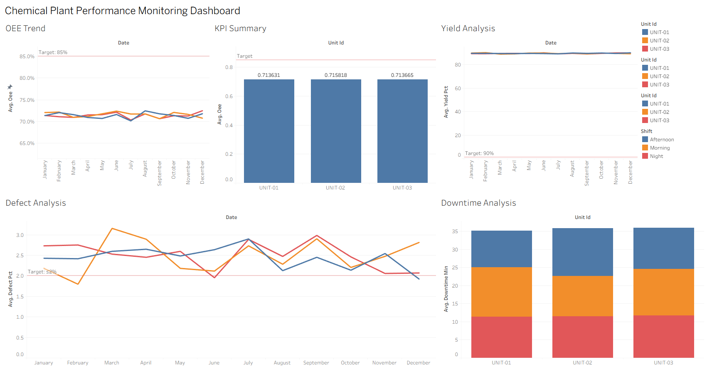
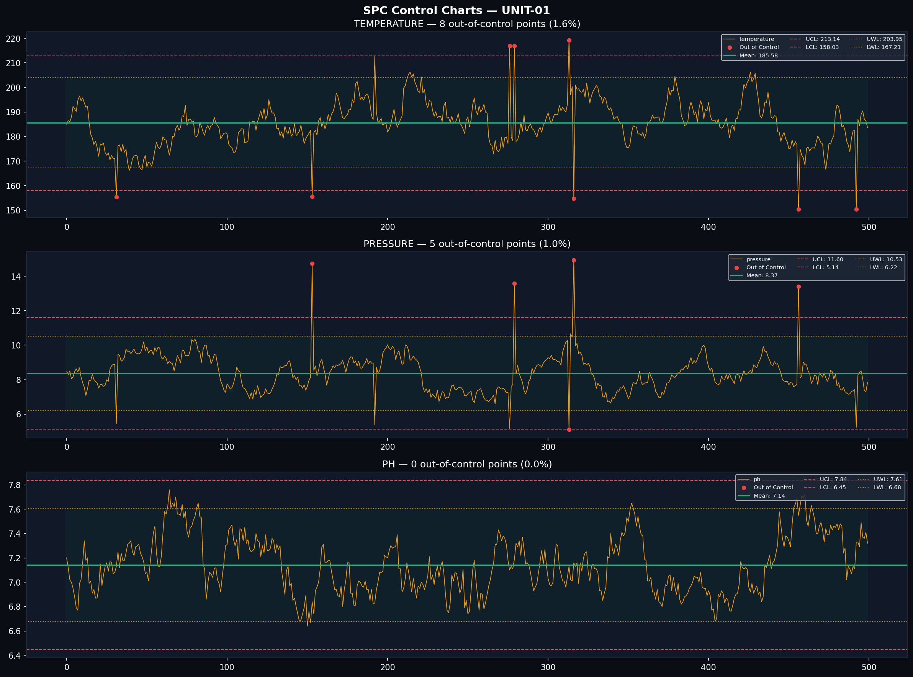
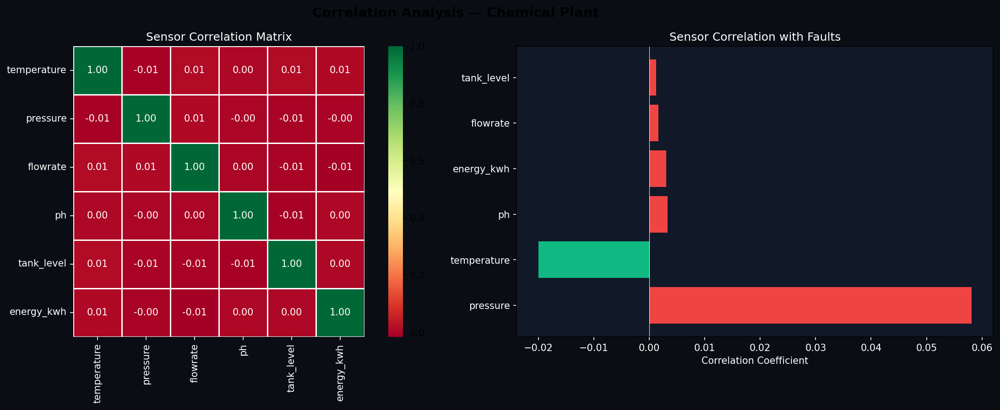

# 🏭 Chemical Plant Performance Monitoring Dashboard


A full end-to-end data engineering project that simulates, 
processes, and visualizes real-time chemical plant KPIs.

## 🎯 Project Overview
Built a complete data pipeline and monitoring dashboard for a 
Phenol Synthesis Plant tracking 3 units across 3 shifts for 
a full year (314,499 sensor readings).

## 📊 Live Dashboard
🔗 [View on Tableau Public](https://public.tableau.com/app/profile/bien.busico/viz/ChemicalPlantDashboard/Dashboard1)

## 🛠️ Tech Stack
| Layer | Tool |
|---|---|
| Data Generation | Python, NumPy, Faker |
| Database | PostgreSQL 18 |
| ETL & Cleaning | Python, Pandas, SQLAlchemy |
| Analysis | Matplotlib, Seaborn, SciPy |
| Dashboard | Tableau Public |
| Version Control | Git & GitHub |

## 📈 Key Results
- **314,499** sensor readings generated and processed
- **OEE: 71.4%** — identified Performance as the weak link
- **Defect %: 2.47%** — above 2% target, July worst month
- **MTBF: 330 min** — equipment runs 5.5hrs between failures
- **8/8 UAT tests passed** — fully validated pipeline

## 🔍 Key Findings
- Pressure is the #1 driver of plant faults (+0.06 correlation)
- Temperature involved in 73% of all fault events
- July has the highest fault rate (2.9%) — seasonal effect
- Performance (75%) is dragging OEE below the 85% target

## 💼 Business Impact

| Metric | Value | Business Meaning |
|---|---|---|
| OEE Measured | 71.4% | 13.6% below 85% industry target |
| Performance Loss | 75% | Primary OEE drag — biggest improvement opportunity |
| Defect Rate | 2.47% | Above 2.0% target — costing rework and waste |
| MTBF | 330 minutes | Equipment fails every ~5.5 hours on average |
| Fault correlation | Pressure #1 at +0.06 | Enables targeted preventive maintenance |
| Temperature involvement | 73% of all faults | Single biggest root cause identified |
| July fault rate | 2.9% peak | Seasonal pattern detected for proactive planning |
| Query performance | <40ms all queries | Production-grade response time achieved |

### 💰 Financial Impact Estimate

| Opportunity | Calculation | Potential Value |
|---|---|---|
| OEE improvement to 85% | +13.6% throughput on existing equipment | ~15–20% revenue uplift |
| Defect rate to 2.0% target | 0.47% reduction × 314,499 readings | Significant rework cost reduction |
| MTBF improvement | Predictive maintenance from fault patterns | 20–30% maintenance cost reduction |
| Pressure-based alerts | Early warning before fault cascade | Prevent unplanned downtime |

### ✅ System Capabilities

- **314,499** sensor readings processed end-to-end
- **Real-time React dashboard** — operators see live KPIs instantly
- **Tableau analytics** — managers get historical trend analysis
- **FastAPI backend** — 6 REST endpoints, all under 40ms
- **Full-stack deployment** — Vercel + Render + Neon PostgreSQL

## 📁 Project Structure

```
chemical_plant_dashboard/
├── data/         → Raw & processed datasets
├── sql/          → Database schema & queries
├── etl/          → Python ETL scripts
├── notebooks/    → Analysis & validation
├── dashboard/    → Tableau files
└── docs/         → Documentation & charts
```

## 🚀 How to Run
### 1. Install dependencies
pip install faker numpy pandas sqlalchemy psycopg2-binary 
matplotlib seaborn scipy schedule

### 2. Set up PostgreSQL database
psql -U postgres
CREATE DATABASE chemical_plant;
\c chemical_plant
\i sql/schema.sql

### 3. Run the pipeline
python etl/generate_data.py
python etl/ingest_data.py
python etl/etl_pipeline.py
python etl/calculate_kpis.py
python notebooks/validation.py

## 📸 Screenshots
### Dashboard Overview


### SPC Control Charts


### Correlation Analysis


## 📜 License & Attribution

This project was built and designed by **beebzy-droid**.

Licensed under the [MIT License](LICENSE) — you are free
to use this code but must include attribution linking
back to this repository.

© 2026 beebzy-droid
🔗 https://github.com/beebzy-droid/chemical-plant-dashboard